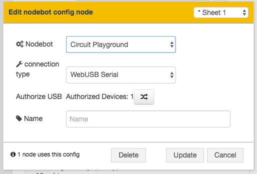
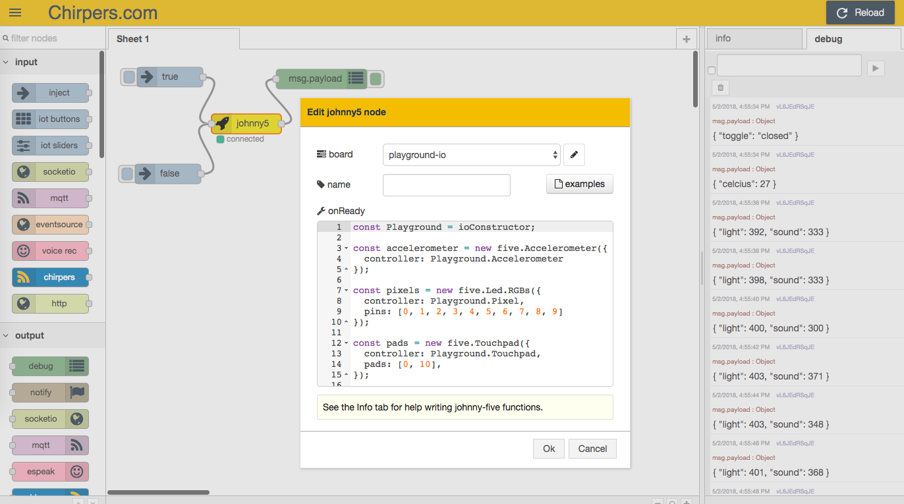

# Circuit Playground Firmata WebUSBSerial

Connect to a classic Adafruit Circuit Playground via the web!


Use arduino to write the CircuitPlaygroundFirmataWebUSB.ino firmware, then:

## Connect it to the web version of the Chirpers IoT platform:

[chirpers.com/browser](https://chirpers.com/browser)

## Create a Johnny-Five Node:
Use Circuit Playground and connection type WebUSB serialOpen



click the Authorize USB button

##  Put some code in the Johhn-five node:



```javascript
const Playground = ioConstructor;

const accelerometer = new five.Accelerometer({
  controller: Playground.Accelerometer
});

const pixels = new five.Led.RGBs({
  controller: Playground.Pixel,
  pins: [0, 1, 2, 3, 4, 5, 6, 7, 8, 9]
});

const pads = new five.Touchpad({
  controller: Playground.Touchpad,
  pads: [0, 10],
});

const piezo = new five.Piezo({
  controller: Playground.Piezo,
  pin: 5,
});

const thermometer = new five.Thermometer({
  controller: Playground.Thermometer,
  freq: 500
});

/**
 * Default Component Controllers
 * @type {five}
 */
const buttons = new five.Buttons([19, 4]);

const led = new five.Led(13);

const light = new five.Sensor({
  pin: "A5",
  freq: 100
});

const sound = new five.Sensor({
  pin: "A4",
  freq: 100
});

const toggle = new five.Switch(21);

/**
 * Events and Data Handling
 */
accelerometer.on("tap", (data) => {
  piezo.frequency(data.double ? 1500 : 500, 50);
  console.log('tap', data);
  node.send({payload: {tap: data}});
});

board.loop(2000, () => {
  node.send({payload: {
    light: light.value,
    sound: sound.value
  }});
});

buttons.on("press", (button) => {
  console.log("Which button was pressed? ", button.pin);
  if (button.pin === 4) {
    led.on();
  }
  if (button.pin === 19) {
    led.off();
  }
});

thermometer.on("change", (data) => {
  console.log("Celcius: %d", data.C);
  node.send({payload: {celcius: data.C}});
});

pads.on("change", (data) => {
  if (data.type === "down") {
    piezo.frequency(700, 50);
  } else {
    piezo.noTone();
  }
});

let index = 0;
const colors = [
  "red",
  "orange",
  "yellow",
  "green",
  "blue",
  "indigo",
  "violet",
];

setInterval(() => {
  pixels.forEach(pixel => pixel.color(colors[index]));
  if (++index === colors.length) {
    index = 0;
  }
}, 300);


 // "closed" the switch is closed
toggle.on("close", function() {
  console.log("closed");
  node.send({payload: {toggle: 'closed'}});
});

// "open" the switch is opened
toggle.on("open", function() {
  console.log("open");
  node.send({payload: {toggle: 'open'}});
});

node.on('input', (msg) => {
  if(msg.payload) {
    led.on();
  }
  else {
    led.off();
  }
});

```

# hit run!
